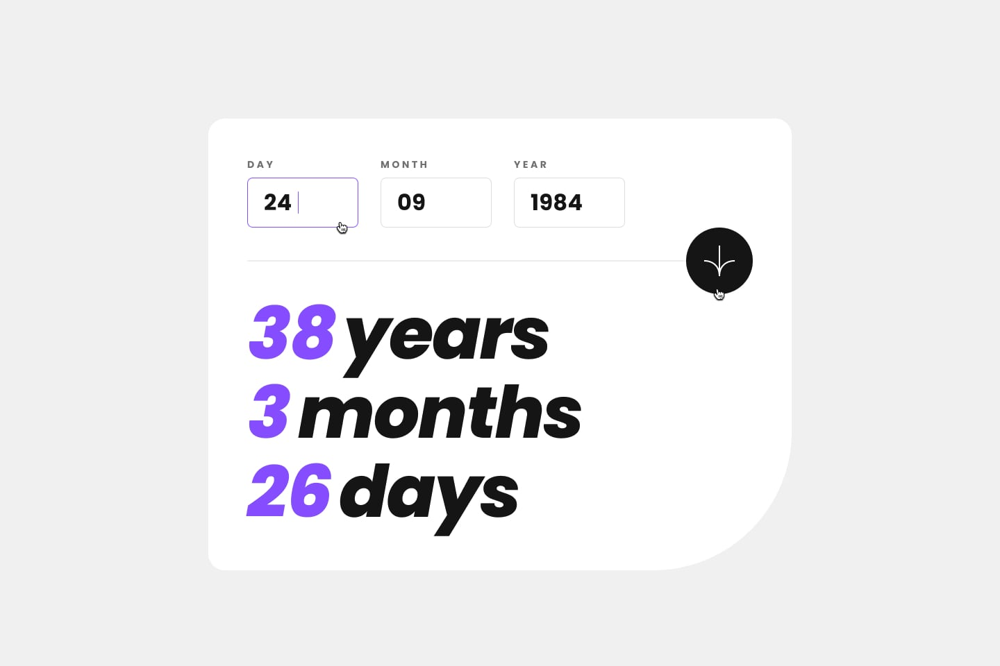
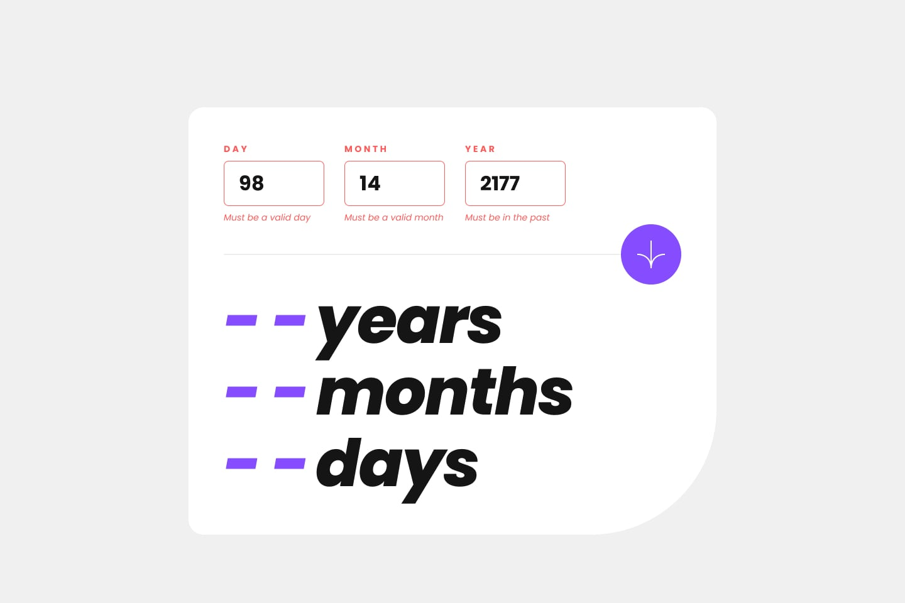

# Frontend Mentor - Age Calculator App Solution

This is my solution to the **Age Calculator App** challenge on Frontend Mentor. This project focuses on building an interactive and responsive application that calculates a user's exact age in years, months, and days based on a given birth date using HTML, CSS, and vanilla JavaScript.

The challenge was a great opportunity to practice form validation, date manipulation, DOM interaction, and responsive UI design without relying on frameworks or external libraries.

---

## Table of contents
- [Overview](#overview)
- [The challenge](#the-challenge)
- [Design](#design)
- [Links](#links)
- [My process](#my-process)
- [Built with](#built-with)
- [What I learned](#what-i-learned)

---

## Overview
This project is a responsive age calculator that allows users to input a valid date (day, month, and year) and receive their precise age in years, months, and days.

The interface includes real-time input behavior, custom validation messages, and dynamic updates of calculated results. The application ensures accurate date handling, including leap years and varying month lengths.

All styling is handled with modern CSS techniques, while the core logic and validation are implemented using vanilla JavaScript through DOM manipulation and event-driven programming.

---

## The challenge
Users should be able to:

- View the optimal layout depending on their device’s screen size.
- Input their birth date using day, month, and year fields.
- Receive accurate age calculations in years, months, and days.
- See validation errors for invalid or incomplete inputs.
- Validate that:
  - All fields are required.
  - The date is valid (e.g., no February 30).
  - The date is in the past.
- Experience automatic focus movement between inputs.
- See hover and focus states for interactive elements.
- Experience smooth UI feedback and transitions.

---

## Design

- Desktop Design  

- Desktop Completed  

- Active States  

- Desktop Error Empty  

- Desktop Error Invalid

- Mobile Design  

---

## Links
- Solution URL: [GitHub Repository](https://github.com/mlopezl/age-calculator-app)
- Live Site URL: [Live Demo](https://mlopezl.github.io/age-calculator-app/)

---

## My process
- Structured the layout using **semantic HTML5** elements such as `form`, `main`, and `section`.
- Followed a **mobile-first approach**, progressively enhancing the layout using media queries.
- Built the layout using **Flexbox** for alignment and responsive structure.
- Used **CSS custom properties (variables)** to create a consistent color system.
- Applied the **BEM naming convention** for scalable and maintainable CSS architecture.
- Designed reusable UI components such as inputs, buttons, and result sections.
- Implemented custom form validation logic using JavaScript.
- Created dynamic error handling by toggling visibility of validation messages.
- Used **JavaScript DOM manipulation** to update the UI with calculated results.
- Implemented automatic input focus transitions to improve user experience.
- Built a custom age calculation algorithm handling:
  - Month/day adjustments
  - Leap years
  - Accurate date differences
- Prevented default form submission behavior to control app logic.
- Maintained separation of concerns between structure (HTML), styling (CSS), and behavior (JavaScript).

---

## Built with
- HTML5
- CSS3
- JavaScript (ES6)
- Flexbox
- CSS custom properties (variables)
- Mobile-first workflow
- Responsive design principles
- BEM naming methodology
- DOM manipulation
- Event listeners
- Date API
- Form validation logic
- Media queries

---

## What I learned
- Structuring interactive forms using **semantic HTML**.
- Building responsive layouts with **Flexbox** and mobile-first design.
- Organizing scalable styles using the **BEM methodology**.
- Creating reusable and maintainable styles with **CSS variables**.
- Implementing custom form validation beyond native browser behavior.
- Working with the **JavaScript Date API** to calculate precise age differences.
- Handling edge cases such as leap years and varying month lengths.
- Improving UX with automatic input focus transitions.
- Dynamically updating UI elements using **DOM manipulation**.
- Managing UI states by toggling CSS classes.
- Writing clean, modular, and maintainable frontend code without frameworks.